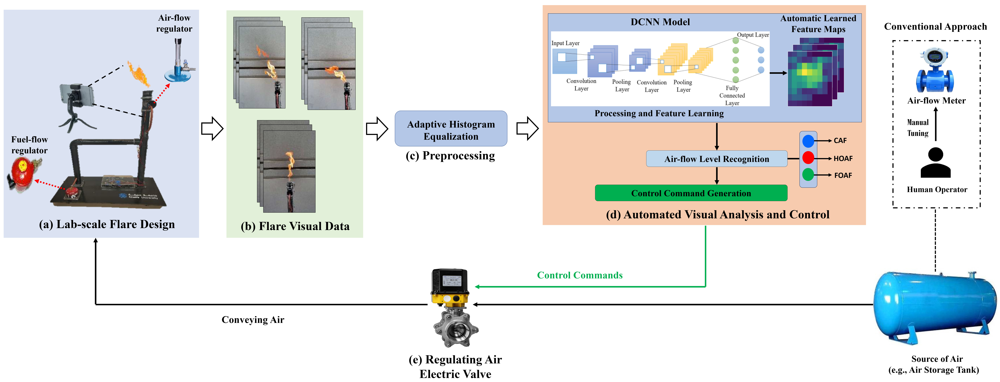

# Vision-based air-flow monitoring in an industrial flare system design using deep convolutional neural networks
[ESWA](www.google.com) | [Cite](#references)



***Overview:** The first work to utilize vision to build an air-flow monitoring system in industrial flares that supports real-time, robust, efficient, accurate diagnosis, and automatic/human-in-the-loop decision making.*

***Abstract:** Flaring is the most common practice in the oil and gas industry to dispose of waste gases. However, this seemingly straightforward process is complex as the performance of the flare is influenced by a multitude of parameters that are rarely being static. One of the most influencing parameters is the amount of air involved in the combustion, which is often adjusted manually by operators. As such, flaring can be less efficient with issues like over-aeration, leading to unburned fuels in air-assisted flares. In this paper, an efficient approach for automatic and efficient monitoring of air-flow based on deep convolutional neural networks (DCNNs) is proposed. First, a novel lab-scale flare system with controllable operational parameters is designed, built, and tested under different operating conditions involving varying fuel and air-flow rates. Second, a comprehensive dataset is meticulously collected and used to train and evaluate twelve state-of-the-art DCNN models. The proposed models are implemented as feature extractors for effective learning of image visual representations for the recognition of three-class air-flow levels: Closed Air-flow (CAF), Half-opened Air-flow (HOAF), and Fully-opened Air-flow (FOAF). Additionally, different preprocessing techniques - Global Contrast Normalization (GCN), Adaptive Histogram Equalization (AHE), and Contrast Limited Adaptive Histogram Equalization(CLAHE) - are evaluated to enhance model robustness under varying visual conditions. Among all models and preprocessing strategies, EfficientNetB7 with AHE preprocessing demonstrated the best performance, achieving an accuracy of 99.04\% and F1-score of 98.85\%. The real-time deployment of this method advances the literature by showing how automated air-flow monitoring can optimize flare performance, reduce emissions, and improve operational efficiency, supporting more sustainable industrial practices. For reproducibility purposes, the dataset and code will be made publicly available.


## Pre-requisites:

## Training:

## Inference:

## Examples:

## References:
```
@article{airflow,
  title={Vision-based Air-flow Monitoring System Design in Industrial Flares using Transfer Learning with Deep Convolutional Neural Networks},
  author={....},
  journal={Expert Systems with Applications},
  volume={..},
  number={..},
  pages={...},
  year={2025},
  publisher={Elsevier}
}
```

